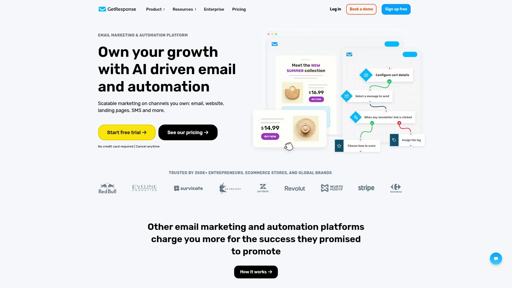
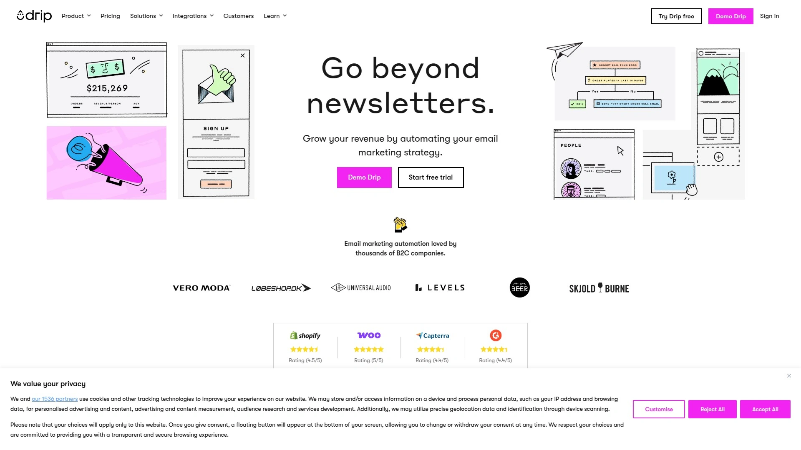

# 2025's Best 22 Email Marketing Platforms

Ever spent half the day trying to figure out why your email campaign looks perfect on your laptop but turns into digital spaghetti on someone's phone? Or maybe you've crafted the perfect subject line only to watch your open rates sit stubbornly below 10%, like they're stuck in quicksand.

Here's the thing about email marketing platforms: the difference between the right one and the wrong one isn't just convenience. It's the gap between emails that land in inboxes versus spam folders, automations that actually work versus ones that send birthday wishes three weeks late, and campaigns that convert versus ones that just exist.

This collection brings together platforms that understand what you actually need—whether you're running flash sales at 2am, nurturing leads through months-long sequences, or just trying to send a decent newsletter without needing a computer science degree. Some cost less than your morning coffee, others pack enterprise features without enterprise headaches, and a few specialize so precisely they feel like they were built just for your industry.

## **[Selzy](https://selzy.com)**

Launch professional email campaigns in minutes without technical overwhelm or budget strain.

Selzy cuts through the noise with a straightforward promise: get your first email campaign live in 15 minutes. The platform targets small businesses, startups, and solo entrepreneurs who need email marketing that works without requiring a dedicated tech team. Behind the clean dashboard sits everything you need—drag-and-drop building, AI-powered copywriting, automated workflows, and detailed analytics.

The email builder operates like assembling blocks. Pre-made content sections snap together, templates adapt to your brand automatically, and the AI writing assistant generates high-converting copy when you're staring at a blank screen. Upload contacts manually, import spreadsheets, or transfer lists from another platform—Selzy handles all three smoothly. Once your email looks right, launch with one click and watch real-time results roll in.

Pricing stands out as genuinely accessible. The free plan lets you send emails to test features and workflows. Paid plans start at $7 monthly for unlimited sends, either capped by contact count or email volume depending on which model fits your business better. Unlike platforms that lock core features behind premium tiers, Selzy provides full automation capabilities, AI assistance, and analytics at every level.

Customer support operates 24/7, responding within five minutes whether you message at noon or 2am on Sunday. The team includes actual email marketers who understand campaign strategy, not just technical troubleshooting. Integration with Zapier connects Selzy to thousands of other tools, while direct connections to ecommerce platforms streamline product promotions and abandoned cart recovery.

For businesses tired of paying enterprise prices for features they'll never use, or struggling with platforms too complicated for daily tasks, Selzy delivers the essentials exceptionally well. Fast setup, reasonable pricing, reliable delivery, responsive support—sometimes that's exactly what email marketing needs to be.

## **[MailerLite](https://www.mailerlite.com)**

Beginner-friendly platform balancing simplicity with powerful automation for growing businesses.

MailerLite earns consistent praise for making email marketing feel less like wrestling software and more like actual marketing. The drag-and-drop editor responds quickly, templates look modern without customization, and navigation makes sense even if you've never run an email campaign before. Over 150 templates cover newsletters, promotions, announcements, and transactional emails.

Automation workflows visualize your email sequences clearly. Drag triggers and conditions onto a canvas, connect them with lines, and watch your automation take shape. Welcome series, abandoned cart reminders, birthday emails, re-engagement campaigns—build them visually without touching code. The system supports complex sequences with multiple branches based on subscriber behavior.

Landing page creation lives inside MailerLite, eliminating the need for separate tools. Design pages that match your emails, embed signup forms, add countdown timers for urgency, and track conversion rates. Pop-ups and embedded forms grow your list across your website, with targeting options that show the right message to the right visitors.

Advanced features include A/B testing for subject lines and content, detailed segmentation based on subscriber activity, and e-commerce integrations for selling digital products directly through emails. The platform tracks opens, clicks, unsubscribes, and revenue generated per campaign. Heatmaps show which parts of your emails get the most engagement.

Free plan supports 1,000 subscribers and 12,000 monthly emails, giving you real room to test before upgrading. Paid plans start at $9 monthly, unlocking unlimited emails, multiple users, and priority support. The pricing scales predictably as your list grows, avoiding sudden jumps that force you to reconsider your platform choice.

## **[Brevo](https://www.brevo.com)**

Comprehensive marketing suite combining email, SMS, CRM, and automation at budget-friendly rates.

Brevo (formerly Sendinblue) operates as more than just an email platform. SMS campaigns, transactional emails, CRM functionality, marketing automation, and live chat all live under one dashboard. This consolidation appeals to businesses juggling multiple communication channels who'd rather manage everything in one place than coordinate between separate tools.

The free plan genuinely impresses—300 emails daily to unlimited contacts. That's 9,000 monthly emails without spending anything, enough for many small businesses to run their entire email program. Paid plans start at $8 monthly for 5,000 sends, with the unique feature of supporting up to 500,000 contacts even on entry-level tiers. Your list can grow massively without triggering price increases.

Email creation uses a drag-and-drop interface that's functional if not fancy. About 40 templates provide starting points, fewer than competitors but covering essential use cases. Where Brevo excels is automation sophistication—12 pre-built workflow templates handle abandoned carts, lead nurturing, personalized follow-ups, and cross-channel sequences combining email and SMS.

Marketing automation supports website tracking, triggering sequences based on page visits, form submissions, or specific actions. Build complex customer journeys with conditional logic, time delays, and branching paths. The CRM tracks interactions across marketing and sales touchpoints, giving you visibility into the full customer relationship.

SMS and WhatsApp messaging expand your reach beyond email. Send transactional messages like order confirmations, shipping updates, and appointment reminders. Multi-channel campaigns coordinate timing across email, SMS, and messaging apps. For businesses wanting comprehensive communication tools without assembling a tech stack from five different vendors, Brevo delivers considerable value.

## **[ActiveCampaign](https://www.activecampaign.com)**

Advanced automation powerhouse for businesses ready to leverage sophisticated marketing workflows.

ActiveCampaign targets marketers who've outgrown basic platforms and need automation that actually matches their strategy. With over 900 pre-built workflow templates, the platform handles virtually any sales or marketing process you can imagine. The automation builder combines visual simplicity with deep functionality—drag-and-drop interface backed by extensive customization options.

The email editor impresses with 240+ templates and intuitive design tools. Building attractive emails happens quickly, with responsive previews showing how designs adapt across devices. Landing pages use a similar editor, with 60+ templates for lead capture, product launches, webinars, and events. Forms integrate seamlessly, feeding leads directly into automated nurture sequences.

CRM integration sets ActiveCampaign apart. Marketing and sales workflows connect, creating unified customer journeys from first website visit through purchase and beyond. Sales automation includes deal tracking, task assignments, and pipeline management. Lead scoring uses behavioral data and AI-powered predictive analytics to identify high-value prospects worth prioritizing.

Machine learning enhances targeting through predictive sending that determines optimal send times per subscriber, win probability scoring that forecasts which deals will close, and content recommendations that suggest what to send based on past performance. These AI features operate quietly in the background, improving results without requiring constant attention.

The learning curve exists—ActiveCampaign packs so much functionality that mastery takes time. However, the investment pays off through automation sophistication unmatched by simpler platforms. Businesses running complex funnels, coordinating between marketing and sales teams, or needing granular control over customer journeys find ActiveCampaign's capabilities worth the complexity.

Pricing starts at $15 monthly for 1,000 contacts with 10,000 email sends, plus a 14-day free trial. Plans scale with contact count, and higher tiers add features like site messaging, custom reporting, and dedicated account management.

## **[Mailchimp](https://mailchimp.com)**

Established platform offering broad features though pricing and complexity have grown over time.

Mailchimp built its reputation as the go-to email platform for small businesses, growing into an all-in-one marketing suite. The platform provides email campaigns, automation, landing pages, forms, social media advertising, and analytics. Recognition and integration support remain strong—most tools you use probably connect with Mailchimp.

Over 300 integrations link Mailchimp to websites, ecommerce stores, CRMs, and business tools. The drag-and-drop email builder offers extensive templates and customization options. AI features assist with content generation, subject line suggestions, and send time optimization. Advanced audience segmentation targets subscribers based on behavior, demographics, and engagement patterns.

Automation includes abandoned cart recovery, welcome sequences, product recommendations, and re-engagement campaigns. A/B testing covers subject lines, content, and send times. Analytics track campaign performance with demographic breakdowns, comparative reports, and revenue attribution for ecommerce integrations.

Concerns emerge around pricing and value. The free plan limits you to 500 contacts and 1,000 monthly emails—tight constraints compared to competitors offering more generous free tiers. Paid plans start at $13 monthly but costs escalate quickly as your list grows. Users report that features once included in basic plans now require premium tiers.

Customer sentiment has declined in recent years. Trustpilot ratings sit at 2.8 out of 5, with complaints about unexpected account suspensions, difficult support access, and pricing increases. The platform works reliably for basic needs, but newer alternatives often deliver better value and user experience.

Mailchimp remains viable for businesses already integrated into its ecosystem or needing its specific third-party connections. However, for those starting fresh or reconsidering their platform choice, exploring alternatives makes sense.

## **[Klaviyo](https://www.klaviyo.com)**

Ecommerce-specialized platform delivering advanced personalization through deep data integration.

Klaviyo built its entire platform around ecommerce, and that focus shows. Native integrations with Shopify, Magento, BigCommerce, and WooCommerce sync customer and order data in real-time. This automatic data flow enables targeting and personalization that generic email platforms struggle to match.

Segmentation goes beyond basic demographics. Build audiences based on purchase history, browsing behavior, cart contents, customer lifetime value, predicted next purchase date, and hundreds of other ecommerce-specific attributes. Send different emails to first-time buyers versus loyal customers, high spenders versus bargain hunters, or anyone who viewed a specific product category three times.

Email flows automate critical ecommerce scenarios. Abandoned cart sequences recover lost sales with personalized reminders showing exactly what someone left behind. Welcome series introduce your brand while recommending products based on signup source. Post-purchase flows request reviews, suggest complementary products, and re-engage customers when they're likely to buy again.

Dynamic content personalizes emails at scale. Product recommendation blocks automatically populate with items relevant to each recipient based on their behavior. Countdown timers create urgency for sales. Dynamic pricing adjusts offers based on customer segment or loyalty tier. Every email can look personalized even when sent to thousands.

Pricing reflects Klaviyo's premium positioning. Plans start at $20 monthly for 500 contacts and 5,000 email sends. Costs increase as your list grows, potentially reaching hundreds monthly for larger businesses. The free plan supports 250 contacts and 500 sends—enough for testing but not sustained use.

Trustpilot reviews average 2.1 out of 5, with complaints about aggressive pricing escalation and customer service issues. However, ecommerce brands seeing significant revenue from email often accept these costs because Klaviyo's ecommerce-specific features drive results that justify the expense.

For online stores serious about email marketing and willing to invest in sophisticated tools, Klaviyo delivers powerful capabilities. Businesses with simpler needs or tighter budgets should explore more affordable alternatives first.

## **[Omnisend](https://www.omnisend.com)**

Ecommerce marketing platform seamlessly blending email, SMS, and automation workflows.

Omnisend built its platform specifically for online stores, packing in features that ecommerce businesses actually use daily. Over 150,000 stores rely on it to send emails, SMS messages, and push notifications from one unified dashboard. The platform connects directly to Shopify, WooCommerce, BigCommerce, and other major ecommerce platforms, automatically syncing product catalogs and customer data.

Pre-made automation workflows get you running fast. Abandoned cart recovery, welcome series, browse abandonment, order confirmation, shipping notifications, review requests, win-back campaigns—all come as one-click templates. Just activate them and customize the timing, messaging, and offers to match your brand.

The email builder designed specifically for product emails makes showcasing merchandise effortless. Drag product blocks directly into emails, pulling images, descriptions, and prices automatically from your store. Product recommendations personalize based on browsing history and past purchases. Discount codes generate dynamically within emails.

SMS campaigns run alongside email, reaching customers on their phones when email alone isn't enough. Combine both channels in automated workflows—send an abandoned cart email after 1 hour, follow with an SMS reminder after 24 hours. Pop-ups and forms capture emails and phone numbers through exit-intent triggers, spin-to-win wheels, and embedded signup boxes.

Segmentation targets customers based on purchase behavior, lifetime value, location, engagement level, and product preferences. Send different campaigns to VIP customers versus first-time buyers. Create segments for specific product categories or price points. The built-in AI generates email copy, subject lines, and preheaders when you're stuck for words.

Free plan includes 250 contacts and 500 monthly emails, letting you test all features before committing. Paid plans start at $16 monthly, scaling based on contact count. All plans include email, SMS, push notifications, and unlimited automations. The pricing remains competitive compared to similar ecommerce-focused platforms.

Support operates 24/7 through email and live chat even for free users—unusual generosity that helps when campaign issues arise outside business hours.

## **[ConvertKit (Kit)](https://kit.com)**

Creator-focused platform emphasizing audience growth and digital product sales for independent professionals.

ConvertKit rebranded to Kit but kept its creator-first philosophy intact. The platform targets bloggers, podcasters, YouTubers, course creators, and digital entrepreneurs building audience-based businesses. Features reflect this focus—everything centers on subscriber growth, content delivery, and monetization through digital products.

Visual automation builder creates subscriber journeys without code. Welcome new subscribers, deliver lead magnets, promote digital products, segment based on link clicks, tag subscribers by interest—all using drag-and-drop workflow design. The system feels intuitive even if you've never built automations before.

Email sequences deliver content automatically. Set up evergreen funnels that onboard new subscribers weeks after they join. Create courses delivered via email. Send different sequences based on which lead magnet someone downloaded. Tagging and segmentation organize your audience by interests, purchase history, and engagement level.

Landing pages and forms help grow your list. Build dedicated pages for lead magnets, product launches, or course signups. Embed forms on your website or share signup links across social media. The platform integrates with Stripe and Gumroad, handling payments for digital products, subscriptions, and courses directly.

RSS-to-email automation sends your latest blog posts or podcast episodes to subscribers automatically. Customize the introduction, let Kit pull in your content, and maintain consistent contact without manual campaign creation each time you publish.

The free plan supports 10,000 subscribers with unlimited email sends—extraordinarily generous compared to most platforms. Paid plans start at $25 monthly, adding advanced features like automation sequences, subscriber scoring, and custom domains. The pricing structure charges based on subscriber count rather than email volume.

Support quality receives positive marks, though features lean simpler than enterprise platforms. Kit works brilliantly for creators focused on building relationships with audiences through consistent, personalized communication. Ecommerce stores or businesses needing complex automation might find it limiting.

## **[GetResponse](https://www.getresponse.com)**

Scalable platform growing with your business from simple emails through advanced funnels and courses.

GetResponse structures its offerings in tiers that match business evolution. Start with basic email campaigns and forms, upgrade to marketing automation and funnels, then level up to course creation and webinar hosting. This approach lets you pay for only what you need currently while knowing more advanced tools await when ready.

The email editor and 120+ templates handle newsletter creation smoothly. Unlimited landing pages and signup forms come standard even on entry-level plans. Autoresponders and timed email sequences work automatically, maintaining subscriber engagement without manual sending.

Marketing automation unlocks with higher tiers, providing conditional workflows, web tracking, and behavior-based segmentation. Build customer journeys that react to actions—someone clicks a link, they move down one path; ignore the email, they go down another. This level of automation helps convert leads into customers systematically.

Sales funnels distinguish GetResponse from pure email platforms. Build complete conversion paths combining landing pages, emails, and payment processing. Sell subscriptions, tickets, digital products, or courses through funnels optimized for quick conversions. The funnel builder visualizes the complete customer journey from awareness through purchase.

Course creation tools let you monetize expertise directly. Upload videos, PDFs, and other content. Structure modules and lessons. Charge one-time fees or subscriptions. Student tracking shows completion rates and engagement. For coaches, consultants, and educators, this integrated approach eliminates juggling separate course platforms and email systems.

Free plan provides 500 contacts and 2,500 monthly emails—reasonable for testing. Paid plans start at $15 monthly for unlimited sends to 1,000 contacts. Email-focused businesses find solid value here, while those wanting integrated funnels and course hosting appreciate avoiding multiple tool subscriptions.

## **[Sender](https://www.sender.net)**

Budget-friendly platform packing automation and segmentation into generous free and paid tiers.

Sender positions itself as the smart alternative to overpriced email platforms. The company built its reputation by offering features that competitors reserve for premium plans—like advanced automation and segmentation—completely free. Over 180,000 businesses use Sender, many drawn initially by the pricing but staying because features actually deliver results.

The free plan includes 2,500 subscribers and 15,000 monthly emails. Unlike platforms that cripple free tiers, Sender provides unlimited automation workflows, unlimited segmentation, and 24/7 customer support even at zero cost. You can build sophisticated multi-step sequences without upgrading.

Email design happens through a drag-and-drop builder with premade templates covering common scenarios. One-click product imports pull details, images, and pricing directly from your store into promotional emails. The editor responds quickly, avoiding the lag that plagues some platforms.

Automation templates cover abandoned carts, welcome sequences, purchase confirmations, win-back campaigns, cross-sells, and review requests. The visual automation builder lets you customize these workflows or create entirely new ones. Add delays, conditions, and branches to create sophisticated sequences that react to subscriber behavior.

SMS messaging expands your reach beyond email. Send promotional texts or transactional notifications. Paid plans include free SMS credits monthly equal to your plan cost, making text marketing essentially free for Professional tier subscribers.

Segmentation targets specific subscriber groups based on behavior, demographics, or custom data. Send different campaigns to customers versus prospects, high spenders versus browsers, engaged subscribers versus inactive ones. Personalization inserts subscriber data into subject lines and content.

Analytics track opens, clicks, bounces, unsubscribes, and sales. Geographic heatmaps show where engagement happens. Individual subscriber activity feeds reveal exactly how each person interacts with your campaigns.

Paid plans start at $7 monthly for 2,500 subscribers and 12,000 emails. The pricing remains affordable as you scale, with straightforward tiers avoiding hidden fees or surprise charges. For businesses wanting powerful features without enterprise costs, Sender delivers impressive value.

## **[AWeber](https://www.aweber.com)**

Established email service emphasizing ease of use and support for small business owners.

AWeber has served small businesses since 1998, building a platform that prioritizes simplicity and reliability over cutting-edge features. The company targets entrepreneurs, bloggers, and small business owners who want email marketing that works without requiring extensive technical knowledge.

The drag-and-drop email builder includes AI-powered writing and subject line assistants that save hours when you're stuck for copy. Templates cover common business scenarios—newsletters, promotions, announcements, events. The interface feels straightforward, avoiding feature overload that intimidates beginners.

Automation templates come 90% built, requiring only minor customization before activation. Welcome sequences greet new subscribers. Abandoned cart emails recover lost sales for online stores. Upsell and cross-sell automations suggest related products. Birthday emails, anniversary messages, re-engagement campaigns—set them up once and they run automatically.

Integration with 750+ tools connects AWeber to your existing business stack. WordPress, Shopify, PayPal, Zapier—most platforms you're using probably work with AWeber. This extensive integration support matters when you're building automated workflows across multiple systems.

Customer support emphasizes accessibility. Reach the team via phone, live chat, or email. In-house specialists trained in email marketing provide help, not just technical troubleshooting. The knowledge base includes tutorials, videos, and guides for common scenarios.

Pricing reflects AWeber's position as an established player. Free plan supports limited features. Paid plans start around $12.50 monthly, comparable to competitors but not dramatically cheaper. Users appreciate reliability and support quality more than groundbreaking features.

Some reviewers note AWeber feels less innovative than newer platforms. The feature set covers essentials competently without pushing boundaries. For businesses valuing stability and support over being on the cutting edge, this conservative approach works fine.

## **[Benchmark Email](https://www.benchmarkemail.com)**

User-friendly platform combining AI design tools with responsive support for busy marketers.

Benchmark earned its reputation by removing friction from email marketing. The platform targets marketers who want professional results without wrestling with complicated software. Clean interface, helpful onboarding videos, and smart features that explain themselves as you use them—Benchmark thinks about user experience at every touchpoint.

The drag-and-drop editor makes email creation genuinely easy. Over 120 templates cover industries, holidays, and campaign types. Built-in image library provides stock photos so you're not stuck searching elsewhere. Smart Design AI scans your website and auto-generates branded templates matching your colors, logo, and style in seconds.

Smart Content (AI writing assistant) drafts compelling copy when you're facing blank-screen paralysis. Describe what you want to say, and the tool generates professional copy you can use as-is or customize. This feature alone saves considerable time when creating multiple campaigns.

A/B testing measures what actually works. Test subject lines, send times, or content variations with sample groups, then automatically send the winner to remaining subscribers. This data-driven approach improves performance without guesswork.

Marketing Automation Pro builds customer journeys based on triggers—dates, events, subscriber actions. Someone joins your list? Send a welcome email. Click a link? Send targeted follow-up. The automation templates include welcome messages, promotional sequences, and feedback requests.

Integration with Google Sheets, Zoho, LinkedIn, Shopify, eBay, and hundreds of other apps (via Zapier) keeps Benchmark connected to your business tools. WordPress plugin simplifies list building and automated blog post emails.

Free plan includes core features with Benchmark branding. Paid plans start at $13 monthly for 500 contacts, scaling with list size. The pricing remains transparent—no confusing tiers or hidden fees. Support quality consistently receives praise, with real humans responding helpfully via chat and email.

## **[HubSpot Marketing Hub](https://www.hubspot.com)**

All-in-one platform integrating email marketing with comprehensive CRM and sales tools.

HubSpot operates at a different scale than most email platforms. It's a complete CRM connecting marketing, sales, and customer service in one system. Email marketing becomes one piece of a larger customer relationship strategy rather than a standalone tool. This integration appeals to businesses wanting unified visibility across all customer interactions.

The email editor provides templates and drag-and-drop design tools. Where HubSpot excels is using CRM data to personalize content deeply. Emails automatically populate with contact properties, company information, deal stage, and previous interactions. Advanced segmentation targets based on lead score, lifecycle stage, or any data in your CRM.

Marketing automation connects email sequences with landing pages, forms, workflows, and sales handoffs. Build complex nurture campaigns that react to website behavior, content downloads, email engagement, and sales team activity. The automation visualizes entire customer journeys from first touch through closed deal.

Analytics tie directly to revenue. Track which campaigns generate leads, which leads convert to customers, and the actual revenue attributed to each email. This closed-loop reporting answers the question every marketer hears: what's our email marketing ROI?.

Free plan includes email marketing for up to 1,000 contacts and 500 daily sends. This genuinely useful free tier lets small businesses access CRM and basic email functionality. Paid plans start at $10-20 monthly but increase significantly as you add contacts and advanced features.

Trustpilot ratings of 2.0 out of 5 reveal frustration with complexity, pricing, and support. HubSpot packs immense functionality, but that comes with steep learning curves. Small businesses wanting simple email marketing might feel overwhelmed. However, companies committed to an all-in-one CRM approach find the integrated ecosystem valuable despite its complexity.

## **[Moosend](https://www.moosend.com)**

Affordable automation specialist delivering advanced features at small-business-friendly prices.

Moosend built its platform around a simple premise: powerful marketing automation shouldn't require enterprise budgets. The company targets small businesses and agencies needing sophisticated tools without the price tags charged by market leaders. With an average 4.7 out of 5 rating on G2 and customers including Vogue, Gucci, and Domino's, Moosend has proven it can compete with bigger names.

Automation workflows use a visual editor to create complex sequences. Drag conditions, triggers, delays, and actions onto a canvas. Build abandoned cart recovery, welcome series, post-purchase follow-ups, win-back campaigns—the system supports intricate logic without coding.

Personalization goes beyond basic name insertion. AI-powered product recommendation engine suggests items customers will likely want based on browsing history, past purchases, and behavioral patterns. The system even incorporates real-time weather data to adjust recommendations based on conditions in each subscriber's location—suggesting coats when it's cold, swimsuits when it's hot.

Landing page builder and form creator help capture leads. Design responsive pages that match your brand, embed forms on your website, and track conversion rates. The templates look modern and professional without customization.

Email templates and drag-and-drop newsletter editor speed up campaign creation. The interface responds quickly, avoiding frustrating lag during design work. Segmentation divides your list by demographics, behavior, purchase history, or engagement level. Send laser-targeted messages to specific groups.

Analytics track campaign performance with clear dashboards showing opens, clicks, conversions, and revenue. Individual subscriber activity reveals exactly how each person engages with your emails.

Free 30-day trial includes all features without requiring a credit card. Paid plans start at $7-9 monthly for unlimited emails to 1,000 subscribers. This pricing delivers considerable value—automation, personalization, and analytics at rates lower than many competitors offering less.

## **[Constant Contact](https://www.constantcontact.com)**

Straightforward email service designed for beginners needing reliable basics with strong support.

Constant Contact built its business serving small business owners taking their first steps into email marketing. The platform emphasizes ease of use, educational resources, and responsive support over cutting-edge features. Error-checking catches common mistakes before you hit send—forgotten placeholder text, missing links, broken images.

Pre-designed templates simplify email creation. Choose a layout, add your content, customize colors and fonts, and you're ready to send. The approach works reliably even if you've never designed an email before. Integration with Shopify and WooCommerce connects ecommerce stores directly.

List segmentation, email automation, surveys, coupons, and A/B testing cover essential email marketing needs. While not the most advanced implementation of these features, they work dependably for straightforward campaigns. Social media integration shares emails across your channels.

Customer support distinguishes Constant Contact from many competitors. Reach the team via live chat, phone, or email. In-person seminars (in some markets) teach email marketing fundamentals. For business owners needing hand-holding through the process, this educational approach provides real value.

Generative AI recently launched but remains limited compared to newer platforms. Some templates look dated by current design standards. Email formatting can be tricky, especially when incorporating multiple images. Analytics and reporting feel basic compared to data-rich platforms.

Pricing starts at $12 monthly with a 14-day free trial requiring no credit card. Using a promotional code can reduce costs further. The pricing matches competitors without being dramatically cheaper or more expensive.

Constant Contact works best for beginners wanting simplicity, reliability, and support over advanced features. Experienced marketers may find it limiting.

## **[Drip](https://www.drip.com)**

Ecommerce-specialized automation platform for brands running sophisticated customer journeys.

Drip positions itself as email marketing automation for B2C companies taking ecommerce seriously. The platform targets DTC brands, online retailers, and agencies managing client campaigns where generic email tools fall short. Features emphasize behavioral tracking, advanced segmentation, and ecommerce-specific automation.

Ecommerce integration syncs order data automatically, enabling workflows triggered by purchases, browse behavior, cart activity, and customer value. Build segments that update dynamically based on real-time shopping behavior. Send different emails to VIPs versus first-time visitors, high spenders versus bargain shoppers.

Visual workflow builder creates complex automation without code. Map out entire customer journeys from first website visit through multiple purchases and beyond. Add conditional branches, delays, A/B tests, and tags based on behavior. Pre-built templates cover abandoned carts, welcome sequences, and win-back campaigns.

On-site pop-ups capture emails through exit-intent, timed triggers, or scroll-based activation. Customize designs to match your site, target specific pages or products, and test variations to improve conversion rates. Forms and landing pages extend lead capture capabilities.

Segmentation allows granular targeting. Build audiences based on purchase history, lifetime value, product preferences, engagement level, location, or hundreds of other attributes. Dynamic segments update automatically as customer behavior changes.

Deliverability rates average strong at over 98%. Workflow email open rates exceed 50% and click-through rates top 7%—metrics reflecting Drip's ecommerce-optimized approach.

Customer satisfaction scores reach 97.3%. Live chat responses average under 2 minutes, email replies under 1.6 hours. This responsive support matters when campaign issues need quick resolution.

Pricing starts at $39 monthly with a 14-day free trial. The cost reflects Drip's positioning as a premium ecommerce tool rather than a budget-friendly option. Brands generating significant revenue from email often justify this investment through improved automation and conversion.

## **[EmailOctopus](https://emailoctopus.com)**

Affordable simplicity for small businesses wanting clean email marketing without complications.

EmailOctopus strips email marketing down to essentials executed well. The platform appeals to small businesses, creators, and startups needing effective email campaigns without overwhelming feature sets or enterprise pricing. Founded in 2014, the UK-based company has grown to 50,000+ customers sending 19 billion emails annually.

The drag-and-drop editor feels modern and responsive. Thirty-four pre-built templates provide starting points that actually look current rather than dated. Email creation moves quickly—design, preview, schedule, send. The interface avoids clutter that slows down straightforward tasks.

Automation covers basics well. Welcome campaigns greet new subscribers automatically. Drip sequences deliver content over time. Trigger-based emails respond to subscriber actions. While not as elaborate as enterprise automation platforms, EmailOctopus provides enough functionality for most small business needs.

Landing page builder includes five templates for lead capture. Create simple pages quickly without needing separate tools. Forms embed on your website, growing your list alongside your content.

Segmentation and tagging organize subscribers into targeted groups. Send different campaigns to engaged subscribers versus inactive ones, customers versus prospects, or segments based on interests and behavior.

The free plan genuinely impresses—2,500 contacts and 10,000 monthly emails with no time limit. This generosity lets you build a real email program before spending anything. Near 24/7 live chat and email support even for free users shows commitment to customer success.

Paid plans start at $12 monthly for 500 contacts, remaining affordable as your list grows. EmailOctopus Connect allows sending through Amazon SES for even lower costs if you're technically inclined.

Customer support maintains near-constant availability with fast response times. The knowledge base includes helpful articles and videos explaining common tasks.

## **[beehiiv](https://www.beehiiv.com)**

Newsletter platform emphasizing growth, design flexibility, and creator monetization tools.

beehiiv emerged from Morning Brew alumni who scaled that newsletter to over 4 million subscribers. They built beehiiv incorporating growth principles learned through that experience, creating a platform specifically for newsletter publishers rather than adapting general email tools.

The newsletter editor feels clean and modern, providing design flexibility without complexity. Customize layouts, colors, typography, and spacing to create unique designs that don't look template-based. Recent updates added custom font uploads, addressing a previous limitation.

Website hosting comes standard. Every newsletter gets a website displaying your archive, subscription form, and branding. Free plans use beehiiv subdomains; paid plans add custom domains. This Substack-like approach gives your newsletter an online home beyond inboxes.

Referral program features encourage existing subscribers to share your newsletter with friends. Offer rewards for successful referrals—exclusive content, merchandise, recognition. This built-in growth mechanism helps newsletters expand organically without paid advertising.

Analytics provide deep insights into subscriber behavior, growth rates, engagement patterns, and revenue (for paid newsletters). Data presentation looks clean and modern compared to cluttered dashboards on older platforms.

Monetization tools let you create premium subscriptions, gated content, and paid tiers. Charge for access to certain newsletters or content sections. The platform handles payment processing and subscriber management, letting you focus on content creation.

Polls and interactive elements engage readers directly within newsletters. Embed surveys, questions, or voting to make your newsletter more participatory than typical broadcast emails.

Free plan supports 2,500 subscribers with website hosting, newsletter CMS, advanced customization, analytics, and external embed forms. This generous offering helps creators launch without upfront costs. Paid plans start at $43 monthly, unlocking custom domains, advanced segmentation, and premium features.

The platform excels for independent writers, content creators, media companies, and startups building newsletter-based businesses. It feels less suitable for general email marketing or ecommerce campaigns—beehiiv optimizes specifically for publishers.

## **[SendX](https://www.sendx.io)**

Straightforward email tool balancing simplicity with necessary automation at affordable rates.

SendX targets small businesses, startups, and creators wanting email marketing that just works without overwhelming complexity. The platform packs core features into a clean interface that avoids intimidating users with endless options they'll never use.

Drag-and-drop email builder and template library speed up campaign creation. Design professional emails without coding or design skills. Mobile-responsive templates ensure emails look good across devices.

Automation workflows handle common scenarios—welcome sequences, abandoned cart recovery, birthday emails, re-engagement campaigns. The visual builder creates multi-step sequences with conditions and delays. While not as elaborate as enterprise platforms, SendX provides enough automation for typical small business needs.

Advanced segmentation divides your list based on behavior, demographics, and engagement. Send targeted campaigns to specific groups rather than blasting everyone with the same message. Personalization inserts subscriber data into subject lines and content.

A/B testing compares subject lines, content, and send times to determine what drives better results. Analytics track opens, clicks, conversions, and revenue. Individual subscriber activity shows exactly how each person engages with campaigns.

Integration capabilities connect SendX to your existing tools through direct connections and Zapier. Sync data between platforms and automate workflows across your tech stack.

Pricing starts at $8 monthly with a 14-day free trial. The straightforward tiers avoid confusing feature restrictions—you get all functionality regardless of plan, paying only for subscriber count.

Trustpilot rating of 2.2 out of 5 suggests some users face issues, though reviews appear limited in volume compared to larger platforms. The platform works fine for basic needs but may lack sophistication for complex campaigns.

## **[Campaign Monitor](https://www.campaignmonitor.com)**

Agency-friendly platform providing client management tools alongside email campaign features.

Campaign Monitor serves agencies and businesses managing multiple brands or clients from one account. The platform combines email creation, automation, and analytics with organizational tools for juggling numerous campaigns simultaneously.

Email builder uses drag-and-drop functionality with professional templates. Design emails that look polished without hiring designers. The interface balances power with usability, appealing to both beginners and experienced marketers.

Automation workflows handle subscriber journeys from first contact through conversion and retention. Build welcome series, nurture sequences, cart abandonment recovery, and re-engagement campaigns. Visual workflow builder makes complex automations manageable.

Analytics track campaign performance with clear dashboards and detailed reports. Measure opens, clicks, conversions, and revenue. Compare campaigns over time to identify what works best for your audience.

Client management features let agencies organize multiple accounts, manage billing separately, and provide clients access to their own campaigns and analytics. This multi-account structure simplifies agency workflows.

Pricing reflects Campaign Monitor's positioning as a professional tool. Plans scale based on subscriber count and feature requirements. The platform targets businesses and agencies willing to invest in quality tools rather than budget-conscious startups.

## **[Zoho Campaigns](https://www.zoho.com/campaigns)**

Part of Zoho's business suite, offering email marketing integrated with CRM and productivity tools.

Zoho Campaigns operates within the broader Zoho ecosystem of business applications. For companies already using Zoho CRM, Books, or other Zoho services, Campaigns integrates smoothly, sharing data across platforms without complex connections.

The email editor provides drag-and-drop functionality with templates covering common scenarios. Upload images directly from Unsplash within the editor. Create emails quickly without switching between tabs or tools.

Automation handles basic workflows, though the free plan excludes automation entirely—you need paid tiers starting at $5 monthly to access this feature. Paid plans unlock workflow automations, triggering emails based on subscriber actions.

Segmentation organizes subscribers into targeted groups. Create segments based on demographics, behavior, or engagement. Send relevant content to each group rather than generic blasts to everyone.

Analytics and reporting track campaign performance. Monitor opens, clicks, bounces, and unsubscribes. Form builder helps capture leads across your website.

Free plan limitations became stricter recently—Zoho removed A/B testing and scheduling from free tier, and cut email allowance in half. The free plan now feels quite restricted compared to competitors offering more generous starting tiers.

Integration with other Zoho products provides the main value proposition. For businesses committed to the Zoho ecosystem, Campaigns fits naturally. Those using different tools might find better-featured alternatives elsewhere.

## **[Sendinblue](https://www.sendinblue.com)**

Note: Sendinblue rebranded to Brevo (covered earlier). Same platform, new name, comprehensive multi-channel capabilities at accessible pricing.

## **[MailerSend](https://www.mailersend.com)**

Transactional email service for developers and businesses needing reliable email delivery infrastructure.

MailerSend specializes in transactional emails—order confirmations, password resets, shipping notifications, receipts, and other automated system-generated messages. The platform targets developers and technical teams building email functionality into applications rather than marketers creating campaigns.

API-first design makes integration straightforward for developers. Send emails programmatically, customize templates through code, and track delivery through webhooks. Detailed documentation helps technical teams implement quickly.

Template management lets you design transactional emails once then trigger them through API calls with dynamic content. Separate styling from content, version templates, and test before deploying.

Analytics track delivery rates, opens, clicks, and bounces. Identify deliverability issues quickly and troubleshoot problems before they affect many messages.

Email validation checks addresses before sending, reducing bounce rates and protecting sender reputation. Suppress lists prevent accidentally emailing people who previously unsubscribed.

MailerSend works best for technical teams needing reliable transactional email infrastructure. For traditional marketing campaigns, other platforms provide better-suited tools.

## **What platform fits my business size and budget?**

Budget-conscious businesses under 2,500 subscribers should examine EmailOctopus, Sender, and Selzy. All three provide generous free plans with core features unlocked, letting you build substantial email programs before spending money. EmailOctopus offers 10,000 monthly emails free, Sender provides 15,000, and Selzy delivers full automation capabilities from day one.

Small businesses ready to pay but keeping costs low find value in MailerLite ($9/month), Moosend ($7/month), and Benchmark ($13/month). These platforms balance affordability with features like automation, segmentation, and responsive support. You get professional capabilities without enterprise pricing.

Ecommerce stores benefit from Omnisend, Klaviyo, or Drip—platforms built specifically around online retail needs. Deep ecommerce integrations, product recommendation engines, and purchase-behavior automation justify higher costs through increased sales. Omnisend starts more affordably at $16 monthly while Klaviyo and Drip position as premium options.

Creators, writers, and content publishers should consider Kit (10,000 free subscribers), beehiiv (2,500 free), or Substack. These platforms emphasize audience growth, content delivery, and monetization over traditional marketing features. The generous free tiers acknowledge that creator businesses build slowly.

**How does Selzy work for quick campaign launches?**

Selzy removes technical barriers between you and sending effective emails. The 15-minute setup promise isn't marketing fluff—the platform streamlines every step from uploading contacts through launching campaigns. Drag-and-drop blocks snap together like puzzle pieces, pre-made templates adapt to your brand automatically, and the AI writing assistant generates copy when you're stuck staring at blank screens.

Business owners juggling multiple responsibilities appreciate not needing to become email marketing experts. Upload a spreadsheet of contacts, pick a template, customize the content, and click send. Real-time analytics show exactly who opens, clicks, and converts. Automation handles welcome sequences, abandoned cart reminders, and follow-ups without manual intervention.

The pricing model—unlimited sends starting at $7 monthly—eliminates worrying about staying under email limits during busy periods. Send flash sales at midnight, follow up with customers immediately after purchases, or launch time-sensitive campaigns without calculating if you have enough emails remaining in your plan. Support responds within five minutes regardless of timezone, helping when campaigns need quick fixes. For small businesses and startups needing email marketing that works immediately without lengthy learning curves, **[Selzy](https://selzy.com)** delivers exactly what the name promises—easy email campaigns that actually get sent, opened, and acted upon.
